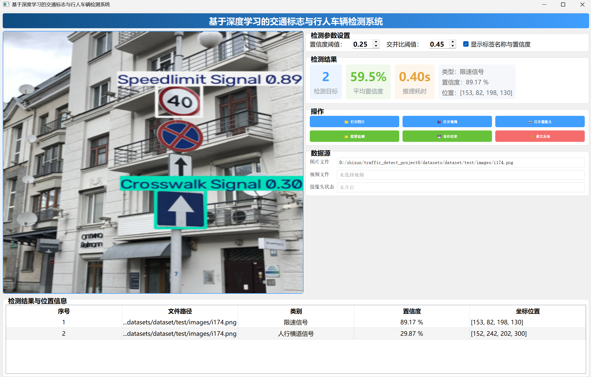
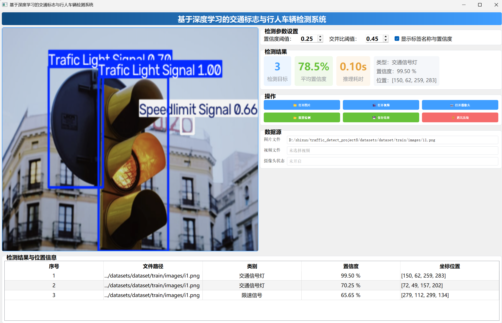
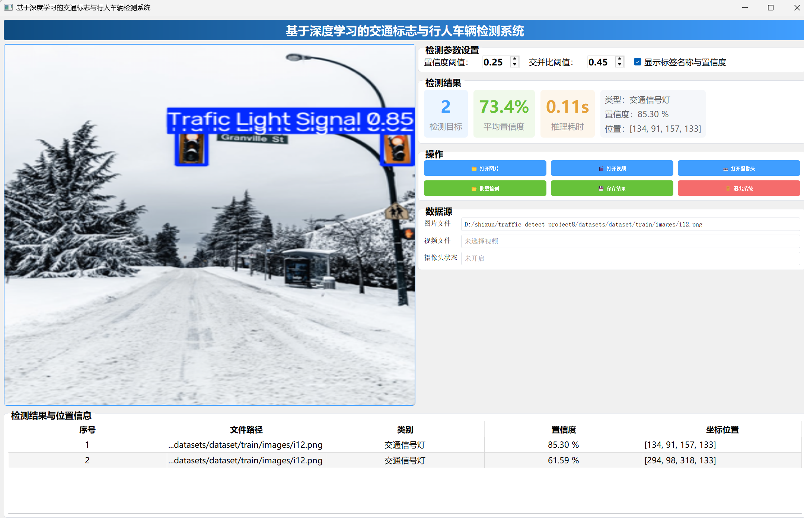
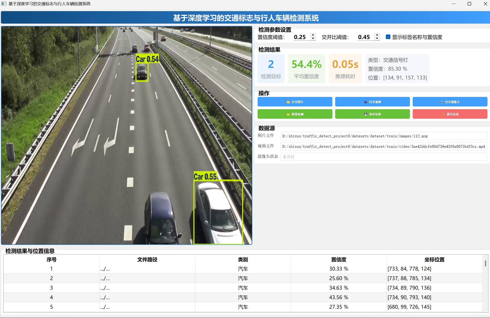

技术栈：
编程语言：Python 3.9
深度学习框架：PyTorch、Ultralytics YOLOv8
图像处理库：OpenCV‑Python、Pillow、NumPy
桌面GUI框架：PyQt5
核心技术点：Qt信号槽机制、QThread多线程异步处理、模型推理、目标框解析、实时视频流处理

核心功能：
多数据源检测：支持静态图片、本地视频文件、摄像头实时画面三种输入模式。
多类别目标识别：可识别行人、机动车、各类交通标志，输出目标类别、置信度、像素坐标。
参数动态调节：界面可修改置信度阈值、IOU非极大抑制阈值，参数变更后自动重新推理刷新检测结果；支持开关标签文字显示。
结果可视化展示：绘制检测框、类别名称与置信度；右侧指标面板实时展示检测目标数量、平均置信度、推理耗时；底部表格逐条记录全部检测目标信息。
批量检测：选择文件夹，自动遍历文件夹内全部图片完成批量推理检测。
结果保存导出：支持保存检测完成后的图片；长视频导出使用异步子线程，搭配进度条，避免UI界面卡死。
目标筛选查看：下拉框可单独选中某一个检测目标，单独查看该目标位置、类别、置信度信息。

系统架构：
采用分层解耦的设计思想，分为UI交互层、业务逻辑层、数据资源层，实现高内聚低耦合。
UI交互层：基于PyQt5实现全部窗口、按钮、表格、指标卡片，通过信号槽与业务逻辑通信。
业务逻辑层：负责调用YOLO模型推理、解析检测框结果、图像绘制、视频读写、异步任务调度。
数据资源层：管理数据集、模型权重、输出保存文件，所有运算本地完成，不需要联网。

数据流转流程：用户界面操作 → Qt信号分发 → 调用检测工具推理 → 解析模型输出结果 → UI渲染画面与表格 → 本地保存输出文件。

项目目录结构：
traffic_detect_project8/
├── datasets/         # 交通标志、行人、车辆标注数据集
├── models/           # 训练得到的模型权重 best.pt
├── runs/             # 训练日志、损失曲线、模型评估结果（自动生成）
├── save_data/        # 检测完成的图片、视频结果保存目录
├── TestFiles/        # 测试用图片、视频素材
├── UIProgram/        # Qt 界面组件、样式、进度条组件
├── MainProgram.py    # 程序主入口，主窗口完整业务逻辑
├── detect_tools.py   # 算法工具封装，图像处理工具函数
├── Config.py         # 全局配置，类别名称、保存路径、模型路径
├── train.py          # YOLOv8 模型训练脚本
├── CameraTest.py     # 摄像头简易测试脚本
├── VideoTest.py      # 视频推理简易测试脚本
├── imgTest.py        # 图片推理简易测试脚本
├── requirements.txt  # 项目依赖清单
├── .gitignore        # git 忽略配置，过滤权重、缓存、虚拟环境
└── README.md         # 项目说明文档

环境依赖安装：
---bash
pip install ultralytics torch opencv-python pillow numpy PyQt5 -i https://mirrors.aliyun.com/pypi/simple/

运行方式：
1.将训练完成的权重文件`best.pt`放置于`models`文件夹。
2.启动主程序：
python MainProgram.py
3.在图形界面选择图片 / 视频 / 摄像头数据源，调节检测参数，执行检测，可查看指标表格、保存检测结果

模型性能：
YOLOv8 模型在交通数据集完成 120 轮训练，训练损失平稳下降，无明显过拟合。
全局 mAP@0.5 达到 0.955；车辆各类别 AP 均高于 0.93。
对小尺寸交通标志、部分遮挡目标具备良好识别鲁棒性。
单帧推理速度快，满足本地桌面端实时检测需求

项目总结：
项目完整完成 YOLO 目标检测模型从训练到桌面软件落地，解决视频处理界面卡顿、参数实时更新、多源数据检测等工程问题。系统具备完整的可视化交互、结果统计、批量处理能力，能够完成交通场景下行人、车辆、交通标志检测任务。
后续可以进一步优化方向：引入更大规模数据集提升恶劣天气、遮挡场景识别精度；功能插件化重构；扩展为 C/S 架构实现云端数据分析

项目演示截图：

